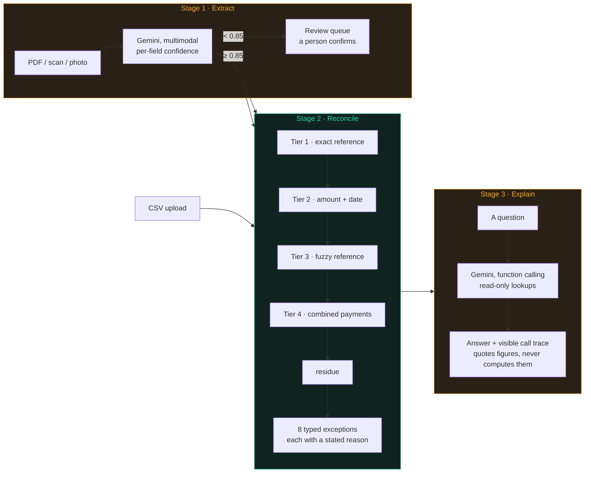

# Reckon

[](https://github.com/AdItyAsIngh1800/Finance_controller/actions/workflows/ci.yml)
[](LICENSE)
[](tsconfig.json)

**Reconciliation that explains itself.**

**Buildathon Track 04 · Submitted 5 September 2026**

Reconciles what a payment processor or bank *says* happened against what an internal ledger says *should* have happened — and, for every discrepancy, states why.

The valuable output of reconciliation is not the list of things that matched. It is the **residue**: the records that did not, and a defensible reason for each.

---

## The idea in one table

The system does three jobs. Two use AI. One deliberately does not, and that is the point.



**Amber stages use a model. The teal one does not, and that is the whole argument.**
Identical input to Stage 2 produces byte-identical output: no scoring to tune, no
model to have an off day, and every match records the tier that claimed it.

| Stage | Job | AI? | Why |
|---|---|---|---|
| **1 — Extract** | Messy PDFs and scans → structured records | **Yes** | Reading unstructured documents is hard for rules and easy for a multimodal model. Every field carries a confidence score; anything under 85% is **quarantined**, never silently guessed. |
| **2 — Reconcile** | Structured records → matches + exceptions | **No — deliberately** | Comparing amounts and dates has exact answers. A model here trades determinism and auditability for nothing. |
| **3 — Explain** | Results → traced natural-language answers | **Yes, constrained** | The agent may only answer from read-only queries against rows the engine produced. It retrieves and phrases; it never computes. |

Ask it *"why was the payout for ORD-4471 short by ₹412?"* and it traces the answer to specific fee and refund lines — showing which queries it ran to get there.

Ask it *"what will next month's payout be?"* and it declines. That refusal is a feature.

---

## How do you know it's right?

Most projects cannot answer this. This one can, with a number.

The synthetic data generator **plants** discrepancies and records exactly what it planted, so engine output is scored against known ground truth rather than eyeballed — per-exception-type precision and recall, plus a false-match count. Results render live at `/evaluation`.

| Metric | Target | Why |
|---|---|---|
| Recall on planted exceptions | ≥ 95% | Missing a discrepancy defeats the purpose |
| **False matches** | **0** | A false exception costs a human 30 seconds. A false match silently hides a real problem — the failure this product exists to prevent. |

The honest caveat, stated up front: **this system has never seen a real bank statement.** Those figures validate the engine's logic, not its assumptions about real-world mess. Full limitations in [`docs/EVALUATION.md`](docs/EVALUATION.md) §6 and on the `/evaluation` page itself.

---

## Features

- Google or email sign-in, with per-user isolation enforced by **database-level Row-Level Security**, not just a login screen
- CSV ingestion for both domains, plus PDF/image extraction for settlement statements — with confidence gating and a human review queue
- Deterministic tiered matching — exact reference → amount+date → fuzzy reference → bounded partial-payment sets
- Fixed, published exception taxonomy; every finding carries a plain-English reason and the numbers behind it
- Two domains — **settlement** (processor payouts, primary) and **bank** (statement vs GL) — against one shared engine
- Grounded Q&A with a visible function-call trace
- Live evaluation page reporting accuracy against ground truth

---

## Stack

TypeScript end to end · Next.js (App Router) · Tailwind · Supabase (Postgres + Auth + Storage) · Google Gemini via `@google/genai` · Vitest · Vercel

The reconciliation engine is **plain TypeScript with no AI, no framework, and one small dependency** (`fastest-levenshtein`). Rationale for every choice — and every rejected alternative — in [`docs/TECH_STACK.md`](docs/TECH_STACK.md).

---

## Getting started

**Prerequisites:** Node 20+, a Supabase project, a Gemini API key.

```bash
git clone <repo-url> && cd razorpay_finance_controller
npm install
cp .env.example .env.local     # fill in the values below
supabase db push               # apply schema + RLS policies
npm run generate:fixtures      # synthetic data + ground-truth manifest
npm run dev                    # http://localhost:3000
```

### Environment variables

| Variable | Scope | Purpose |
|---|---|---|
| `NEXT_PUBLIC_SUPABASE_URL` | client | Supabase project URL |
| `NEXT_PUBLIC_SUPABASE_PUBLISHABLE_KEY` | client | Publishable key — safe to expose **only because RLS is enabled** |
| `GEMINI_API_KEY` | **server** | All Gemini calls originate server-side |
| `GEMINI_MODEL_ID` | server | Model ID as config — provider naming drifts |

### Sign-in

Two paths, both Supabase sessions:

- **Email and password** — works with no configuration beyond one toggle. In
  **Supabase → Authentication → Sign In / Providers → Email**, turn **off**
  "Confirm email". It is on by default, and while on, sign-up waits for a
  confirmation link that Supabase's built-in sender delivers only to project
  members.
- **Google** — one click, but needs the setup below.

#### Google OAuth

Configured once, in two places:

1. **Google Cloud Console** — create an OAuth 2.0 Client ID (Web application) and
   add `https://<project-ref>.supabase.co/auth/v1/callback` as an authorised
   redirect URI.
2. **Supabase → Authentication → Providers → Google** — paste the client ID and
   secret and enable it. Then under **URL Configuration**, add both
   `http://localhost:3000/**` and `https://<your-vercel-domain>/**` to the
   redirect allow-list.

Registering only localhost is the classic failure: sign-in works throughout
development and breaks the moment it is deployed.

---

## Deployment

Vercel, from the GitHub repository.

1. Import the repo at [vercel.com/new](https://vercel.com/new). Next.js is
   detected automatically; no build configuration is required.
2. Set four environment variables — the same values as `.env.local`:
   `NEXT_PUBLIC_SUPABASE_URL`, `NEXT_PUBLIC_SUPABASE_PUBLISHABLE_KEY`,
   `GEMINI_API_KEY`, `GEMINI_MODEL_ID`.
3. Add the deployed domain to Supabase's redirect allow-list (see above) and to
   the Google OAuth client's authorised origins.
4. Sign in **on the deployed URL**, not just locally, and confirm the redirect
   completes.

No database migration step is needed at deploy time — the schema is already
applied. `fixtures/` is gitignored and never deployed; the evaluation page and
the demo seeder both generate their data in process, so neither depends on files
existing on the server.

### Commands

```bash
npm run dev                # development server
npm test                   # unit + ground-truth suite
npm run typecheck          # tsc --noEmit
npm run build              # production build

npm run generate:fixtures  # regenerate synthetic data + ground-truth manifests
npm run scorecard          # per-type precision/recall and false matches
npm run render:documents   # render test statements + a degraded scan
npm run extraction:report  # extraction accuracy and confidence calibration
npm run grounding:report   # adversarial grounding check on the Q&A agent
```

The last four are the honest checks. `npm test` going green cannot distinguish
"recall 1.00 because everything was found" from "recall 1.00 because nothing was
planted" — the reports print the underlying counts.

---

## Demo script

1. **Sign in** — with Google, or with an email and password.
2. **Click "Load a demo dataset"** — 250 record pairs with known discrepancies planted, seeded and reconciled in one action, so the walkthrough starts at results rather than an upload dialog.
3. **Show the review queue** — a degraded scan with two sub-threshold fields, blocked from the ledger. *This is where the product refuses to trust the model.*
4. **Run reconciliation** — match rate, tier breakdown, visible matching parameters.
5. **Open a `FEE_VARIANCE` exception** — both sides side by side, differing line marked.
6. **Ask "why was the payout for ORD-4471 short by ₹412?"** — traced answer, function calls shown.
7. **Ask "what will next month's payout be?"** — it declines. *This is the grounding working.*
8. **Open `/evaluation`** — precision, recall, zero false matches, and the limitations stated in-product.

Prefer your own files over the seeded dataset? [`demo-data/`](demo-data/) has 9
hand-built CSV pairs — one per matching tier and exception type, plus a
full-mix and a hostile-input case — each uploadable directly through the
ingestion form. See [`demo-data/README.md`](demo-data/README.md) for what each
pair is designed to trigger.

---

## Documentation

| Document | Contents |
|---|---|
| [`docs/PRD.md`](docs/PRD.md) | Problem, user, scope, success criteria |
| [`docs/REQUIREMENTS.md`](docs/REQUIREMENTS.md) | Numbered, individually verifiable requirements |
| [`docs/ARCHITECTURE.md`](docs/ARCHITECTURE.md) | Pipeline, adapter pattern, **AI trust boundaries** |
| [`docs/TECH_STACK.md`](docs/TECH_STACK.md) | Every choice with its rationale and rejected alternative |
| [`docs/DATA_MODEL.md`](docs/DATA_MODEL.md) | Schema, frozen exception taxonomy, RLS |
| [`docs/DESIGN.md`](docs/DESIGN.md) | Screens, flows, interaction states |
| [`docs/ROADMAP.md`](docs/ROADMAP.md) | Phases, schedule, risk register |
| [`docs/EVALUATION.md`](docs/EVALUATION.md) | Ground-truth methodology, metrics, **known limitations** |

Start with `ARCHITECTURE.md` §1 — it is the shortest path to what makes this project different.

---

## What this is not

Stated so the boundary is a decision rather than an oversight:

- **Not a system of record.** Advisory analysis, no audit guarantees, no compliance claim.
- **No live bank or processor integrations.** File-based ingestion only.
- **No forecasting.** Deliberate — projecting future cash is the easiest thing to fake convincingly, and this project's whole thesis is refusing to fake things.
- **No write-back.** It never modifies accounting systems.
- **Single currency per dataset.** Cross-currency matching is a correctness trap, not a feature gap.

---

## License

[MIT](LICENSE) © 2026 Aditya Singh
